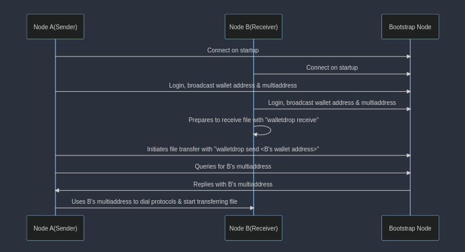

# WalletDrop Network Architecture

WalletDrop leverages the powerful decentralized peer-to-peer technology, Libp2p, to facilitate instant and secure file sharing to wallet addresses or ENS. The network architecture of WalletDrop is designed with efficiency and reliability at its core.

## **Architecture Overview**

The architecture is characterized by two primary entities: the sender and the receiver nodes. Both these nodes are connected to Libp2p Bootstrap Nodes upon startup.

The bootstrap nodes play a crucial role in maintaining a global state of the network. In the context of WalletDrop, the global state signifies that when a user logs in, their node broadcasts its wallet address or ENS along with its associated multiaddress across the network.

Moreover, any new node joining the network will connect to the bootstrap node. The bootstrap node helps this new entrant query the network for the multiaddress corresponding to any wallet address or ENS, thus ensuring seamless integration into the network.

## **Communication Protocols**

The sender and receiver nodes mainly communicate over two distinct protocols.

1. **"/filename/1.0.0"**: This protocol is used to notify the receiver that they are being sent a file. It initiates the file transfer process by alerting the receiver of an incoming file.
2. **"/file/1.0.0"**: This protocol is utilized to transmit the actual contents of the file. It comes into play once the initial handshake has been established with the "/filename/1.0.0" protocol.

## **Network Flow**

Let's delve into a more detailed example to understand the network flow. Suppose we have nodes A (sender) and B (receiver).

1. **Startup**: Upon startup, both nodes A and B connect to the bootstrap nodes.
2. **Login**: After logging in, both nodes broadcast their wallet addresses or ENS across the network.
3. **Prepare for Receiving**: Node B prepares to receive the file using the command **`walletdrop receive`**.
4. **Send Command**: Node A initiates the file transfer using **`walletdrop send <B's wallet address>`**.
5. **Query Network**: Node A then queries the network for B's multiaddress.
6. **Reply to Query**: If available, one of the bootstrap nodes replies to Node A's query with B's multiaddress.
7. **Dial Protocols**: Node A uses B's multiaddress to dial the mentioned protocols and start transferring the file.

This elegant network flow ensures robust and efficient file transfers while maintaining the anonymity of the participants. This architecture also allows WalletDrop to provide a reliable, decentralized, and secure file sharing service. The use of Libp2p empowers WalletDrop with the advantages of a peer-to-peer network, including scalability, high fault tolerance, and resistance to censorship.

